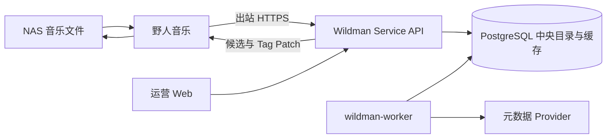

# 系统架构

## 1. 架构目标

Wildman Service 是中央元数据控制面。一个 Go 模块化单体提供运营 Web、客户端 API、目录缓存、匹配任务和 Provider 适配器。野人音乐作为部署在用户 NAS 的数据面，负责本地扫描和写回。



## 2. 职责边界

### 野人音乐

- 遍历本地目录、读取标签和技术参数。
- 生成稳定的 `clientTrackId`，提交最小曲目观测。
- 展示候选和字段差异。
- 用户确认后在 NAS 本地写入并复验。

### Wildman Service

- 运营管理员、客户端凭证、限流和审计。
- 中央 Artist、Release、Recording、Track 目录。
- Provider 调用、共享缓存、来源观测和刷新策略。
- 解析任务、候选评分、证据与冲突。

中央服务不读取野人音乐数据库，不保存 NAS 绝对路径，不执行 ffprobe，也不写用户文件。

## 3. 模块依赖

```text
HTTP Transport → Application → Domain
Infrastructure ─────────────→ Domain
```

- `internal/domain/catalog`：曲目观测、规范实体和候选。
- `internal/domain/client`：客户端安装身份、凭证格式和状态规则。
- `internal/app/client`：客户端凭证与授权用例。
- `internal/app/resolution`：观测接收、幂等请求和匹配编排。
- `internal/app/provider`：最小查询接口、来源候选 DTO 和稳定错误分类；Provider DTO 不进入 Domain。
- `internal/infra/database`：PostgreSQL Repository 和迁移。
- `internal/infra/provider`：外部来源适配器、限流和响应边界。
- `internal/httpserver`：统一响应、Cookie/Bearer 认证、CORS 和参数校验。

只在用例实现时创建包，不预先建立空框架。

## 4. 数据分层

必须区分：

1. **客户端观测**：野人音乐当前看到的文件名、标签、时长和指纹。
2. **来源观测**：Provider 在特定时间返回的不可变 payload 和来源标识。
3. **规范目录**：服务端合并后的 Artist、Release、Recording 和 Track。
4. **解析结果**：针对一次请求生成的候选、分数、证据和冲突。
5. **用户决策**：野人音乐回报的接受、拒绝和写回结果。

Provider payload 不能直接覆盖客户端观测或规范实体。

## 5. 解析流程

```text
认证客户端
  → 校验并 upsert 曲目观测
  → 以 Idempotency-Key 创建解析请求
  → 规范化标题、歌手、专辑和版本关键词
  → 查询中央目录与有效缓存
  → 未命中时合并相同上游请求
  → 受控调用一个 Provider
  → 保存来源观测并更新规范目录
  → 生成候选、证据和冲突
  → 返回野人音乐审核
```

## 6. 缓存策略

- 开放数据集可作为基础目录导入，但不等同于自动信任。
- 用户查询驱动 Provider 补充，不做无差别全量抓取。
- 缓存键由规范化查询和 Provider 版本组成。
- 使用 TTL、stale-while-revalidate、负缓存和并发请求合并。
- 歌词、封面和受限制 payload 使用独立策略，MVP 默认不缓存。

## 7. 身份与隔离

- Web 管理员使用服务端 Session 和 CSRF。
- 野人音乐安装使用独立 Bearer Token；完整 Token 只显示一次，数据库保存 SHA-256 摘要。
- 所有客户端数据查询必须包含服务端认证得到的 `client_id`，不能信任请求体声明。
- MVP 仍支持运营者手动签发客户端；P1 账户与设备授权在独立身份表中实现，不把客户提升为运营管理员。

## 8. 部署与演进

- Web 与独立 Worker 共享 PostgreSQL；Worker 使用行锁安全领取任务。
- Web 与 Worker 都必须通过 `WILDMAN_DATABASE_URL` 连接数据库。
- Provider 先静态编译进单体；插件系统后置。
- PostgreSQL 数据由数据库服务持久化和备份；应用容器不挂载 `/music`，不需要音频解析工具。
