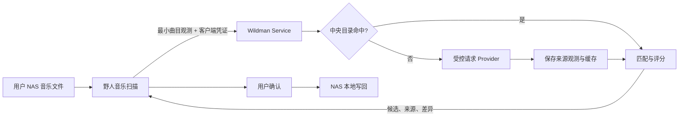

# 产品定义

## 1. 产品定位

Wildman Service 是由 Wildman 运营方部署的中央音乐元数据目录、缓存与匹配服务。它接收野人音乐提交的最小曲目观测，优先查询自己的目录和缓存，必要时受控访问外部 Provider，并返回可解释的元数据候选。

野人音乐仍部署在用户 NAS，负责本地文件扫描、标签读取、播放和用户确认后的安全写回。两者只通过版本化 HTTPS API 通信，不共享数据库，Wildman Service 也不访问用户 NAS。

一句话定位：

> 为野人音乐提供共享缓存、可解释匹配和可追溯来源的中央元数据服务。

## 2. 要解决的问题

- 每个 NAS 实例直接请求第三方接口，会重复消耗额度并触发限流。
- Provider 接口变化时，分散部署的客户端难以及时升级。
- 同一歌手、专辑和歌曲被反复搜索，缺少共享目录与缓存。
- 单一来源不足以判断同名歌曲、现场版、重制版和不同发行版本。
- 用户不应为了匹配元数据而上传完整音乐文件或开放 NAS 入站端口。

## 3. 使用者

- 在 NAS 上运行野人音乐的用户。
- 调用中央接口的野人音乐安装实例。
- 管理客户端凭证、Provider 和缓存状态的服务运营者。

MVP 由运营者手动签发客户端凭证，不包含公开注册、邮箱、计费和开放平台。

## 4. 核心流程

野人音乐只发出主动 HTTPS 请求。默认不上传绝对路径、完整音频、播放历史、歌单或野人音乐数据库。

## 5. 产品原则

1. **缓存优先**：先查中央目录，缓存未命中才访问 Provider。
2. **按需补充**：不盲目抓取所有平台数据；开放数据集打底，真实查询驱动补充与刷新。
3. **来源与规范实体分离**：Provider 返回的是带时间和版本的来源观测，不直接覆盖中央规范目录。
4. **可解释匹配**：候选必须展示分数、正向证据、冲突和来源。
5. **本地写回**：中央服务只返回字段级建议，不直接修改用户文件。
6. **最小数据**：只收集完成匹配所需的标题、歌手、专辑、时长、文件名和可选指纹。
7. **合规优先**：Provider 必须记录授权、限流、缓存和再分发边界。

## 6. MVP 范围

- 中央 Web 服务、独立 Worker、PostgreSQL 和运营管理员 Web 控制台。
- 运营者签发和撤销野人音乐客户端凭证。
- 接收单曲观测并创建幂等解析请求。
- 中央 Artist、Release、Recording、Track 目录。
- 接入一个允许使用和缓存的 Provider。
- 缓存命中、未命中补充、有限重试和请求合并。
- 返回候选、字段差异、来源和置信度。
- 野人音乐完成审核与本地标签写回。

## 7. 非目标

- 不托管、播放、下载或分发音乐文件。
- 不直接访问用户 NAS、野人音乐数据库或本地绝对路径。
- 不绕过登录、会员、验证码、地区或 DRM 限制。
- MVP 不缓存歌词和未经授权的封面资源。
- MVP 不提供公开注册、计费、团队权限或第三方开放平台。
- MVP 不做全平台无差别大规模爬取。

## 8. 成功标准

- 一个野人音乐实例能安全绑定中央服务并提交一首曲目。
- 已缓存曲目不产生 Provider 请求。
- 同一未命中查询的并发请求只触发一次上游访问。
- 候选包含可解释证据，野人音乐可以完成一次本地确认写回。
- 客户端之间数据隔离，日志和 API 不泄露 Token、绝对路径或完整上游密钥。
